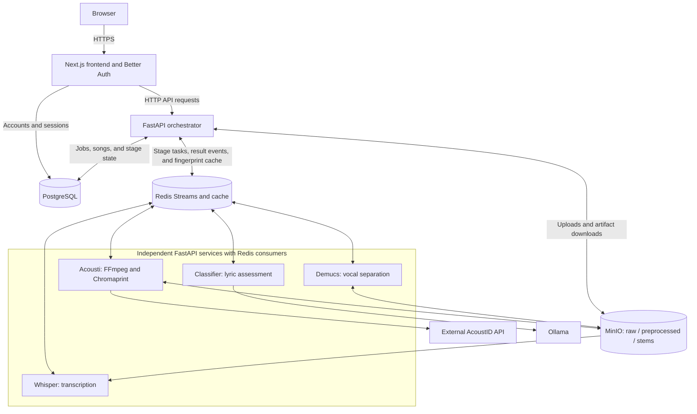

# Architecture

Clankr is a Next.js frontend backed by a FastAPI orchestrator, PostgreSQL, Redis Streams, MinIO, specialist workers, and Ollama.

Worker connections to Redis carry tasks and result events. Audio-processing
workers read and write MinIO objects directly; audio bytes do not pass through
Redis.

In production, Traefik is the only public edge service. It terminates HTTPS and routes the configured hostname to the frontend. Specialist services, PostgreSQL, Redis, MinIO, the orchestrator, and Ollama remain on internal Docker networks.

Authentication stays in Next.js. Better Auth sets the browser session cookie
and handles Google OAuth plus email/password sign-in. Requests to the
application API go through Next.js. Catalog reads, song details and vocal-stem
downloads, and shared queue/completed-job summaries allow anonymous visitors.
For signed-in requests, Next.js validates the session and signs a
short-lived internal identity assertion for the orchestrator. The orchestrator
verifies that assertion before mapping the Better Auth user ID to the local
numeric application user. The proxy strips client-supplied identity assertions.
Submissions, personal history, usage, library changes, and individual job
details/actions still require authentication.

## Request flow

1. The frontend sends `POST /api/analyze` with either `mode=full` or
   `mode=standalone` plus one specialist service.
2. Audio uploads are stored under `raw/` in MinIO; audio bytes never pass through Redis.
3. The orchestrator creates a `jobs` row and one `job_steps` row per requested stage.
4. A Redis Stream task is published for the first stage. Workers consume tasks, read/write MinIO objects, and publish result events.
5. The orchestrator consumes result events, updates PostgreSQL transactionally, and queues the next requested stage.
6. After identification, full jobs check the global fingerprint cache. A hit
   links the existing song to the user and skips the remaining stages.
7. On a cache miss, only a successful full job is upserted into the canonical
   `songs` record. Standalone jobs complete without creating songs. A standalone
   Acousti cache hit may still link an existing song to the user's library.

Redis Streams use consumer groups and at-least-once delivery. Abandoned pending messages can be reclaimed after `REDIS_VISIBILITY_TIMEOUT_MS`.

## Pipeline stages

The fixed order is `identify → demucs → whisper → classify`.

| UI output | Job step | Redis queue | Main result |
| --- | --- | --- | --- |
| Song Info | `identify` | `clankr:queue:identify` | title, artist, fingerprint, duration |
| Stems | `demucs` | `clankr:queue:demucs` | `stems/<name>.wav` |
| Lyrics | `whisper` | `clankr:queue:whisper` | lyrics text |
| Classification | `classify` | `clankr:queue:classify` | `AI`/`Human`, accuracy |

The full-project workflow always requests all four stages with fixed settings.
Demucs writes the vocal stem used by Whisper, and Whisper's transcript feeds the
classifier. Standalone tools request exactly one stage: Acousti, Demucs, and
Whisper accept audio, while the classifier accepts text.

## Product surfaces

- **Full Pipeline** creates a full job. Cache misses become canonical Songs only
  after every stage succeeds. All completed Songs join the public catalog;
  the upload form explains that transcripts, classifications, and vocal stems
  will be public before submission.
- **Tools** creates one-stage standalone jobs. These results remain Jobs rather
  than becoming new Songs.
- **My history** lists a user's completed, failed, and cancelled work. Active
  work appears only in Job Queue. Failed jobs can be rerun as new jobs using
  their original input.
- **All completed** is a public history of completed jobs. Anonymous visitors
  and users viewing someone else's job see only operational summary fields: job ID, type,
  status, stage, and timestamps. Job details and actions remain owner-only.
- **Jobs** opens the public live **Queue** by default. The queue is the live set of all
  jobs with `queued` or `processing` status, ordered to show work currently
  executing before work waiting to run.
  A stage summary shows queued and running counts for the loaded jobs (the API
  returns at most 100). These are a snapshot of work at each stage, not worker
  utilization or a definitive bottleneck diagnosis. Owner-only job details show
  elapsed processing time from the existing step start and completion timestamps.
  Queue, personal history, and shared completed history are tabs on this page.
- **Songs** opens the public global catalog by default. Existing and future
  completed Songs, including metadata, transcripts, classifications, and vocal-stem
  downloads, can be browsed without an account. Signed-in users can also open
  **My songs** to manage their library. Removing a Song from a library does not
  delete the public catalog entry.

## Service boundaries

Each specialist is a standalone FastAPI application with a Redis consumer in its lifespan. The orchestrator owns sequencing and PostgreSQL writes. The classifier calls Ollama over HTTP and returns the normalized classification result.

## Redis configuration

Development and production run Redis 7 on the internal Docker network. The application reads `REDIS_URL`, defaulting to `redis://redis:6379/0`. Redis is both the asynchronous transport and a best-effort fingerprint-to-song cache; PostgreSQL remains authoritative.

## Reliability and constraints

- PostgreSQL is the source of truth for jobs and songs.
- Duplicate result events are ignored after a step is complete.
- Failed stages mark both the step and parent job `failed`; automatic retries are not implemented.
- User-requested retries create a new job and rerun the selected fixed workflow.
- MinIO object-key contracts are `raw/`, `preprocessed/`, and `stems/`.
- `database/init.sql` is initialization-only, not a migration system.
- There is no external metrics backend, tracing system, or dead-letter workflow yet.

## Observability and benchmark runs

The Python services write structured JSON lifecycle events to stdout. Docker
retains normal production output through its configured rotating `json-file`
driver; PostgreSQL is not on the hot logging path. Events correlate a job, task,
stage, attempt, worker, release, and optional benchmark run without recording
audio bytes or lyrics. See [benchmarking.md](benchmarking.md) for the event
schema, ordinary-log inspection, and the isolated same-VM Demucs benchmark
harness.
