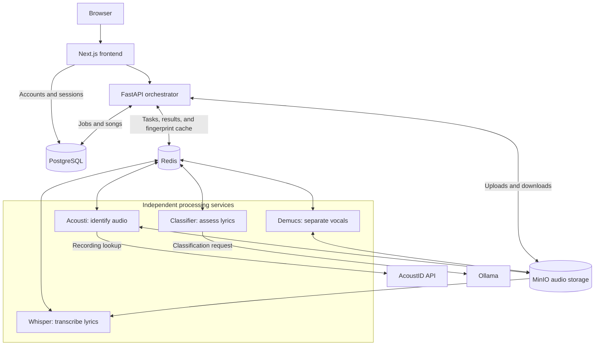

# Clankr

Clankr is a music-processing project that takes a recording, separates the vocals, transcribes them into lyrics, and tries to classify whether those lyrics are AI-generated. Each service can also be used on its own.

Built by [Andrew Weckwerth](https://www.linkedin.com/in/andrew-weckwerth/) · [Live site](https://clankr.app)

You can browse the job queue and public song catalog without an account. Every completed full-pipeline song joins the catalog, including its transcript, classification, and downloadable vocal stem. Sign in to submit jobs or manage your own library.

## How it started

I started this project through making music. I was using Demucs, an open-source AI tool, to separate songs into stems for samples. That got me interested in how it worked and in other tools like Whisper. I had an idea to programmatically connect them: separate the vocals with Demucs, transcribe them with Whisper, then pass the lyrics to a classifier. I wanted each part to be a small microservice so I could use and change the services separately.

## How it changed

Once I connected everything, I realized how bulky and slow the pipeline could be. Running the same audio through every stage again was wasted work, so I added audio fingerprinting through the Acousti service, which uses Chromaprint and AcoustID. This lets the pipeline check whether a recording has already been processed and reuse the saved result.

After using Redis during my internship at Watlow, I came back to Clankr and added it here. I moved the processing work from direct HTTP calls between services to a Redis job queue. Once that stabilized things, I started looking at throughput.

Demucs was the bottleneck, so my first benchmark compared one through five Demucs containers on the same VM. In that test, five containers finished a 10-job batch in about 25 minutes, compared with about 36 minutes for one. Most of the improvement came from going from one to two containers, and individual jobs took longer to process as more ran at once. The [first benchmark report](docs/first-benchmark-results.md) has the results and setup.

That surprised me. I expected one container to already use most of the resources on a small VM. I still want to understand why multiple containers helped; this test alone doesn't explain it. It also used the same song for every job, so I wouldn't assume the result holds for every workload.

## Next Steps

After the initial benchmark testing I realized I need to do more realistic benchmarks: more jobs, different songs and job types, and repeated runs. I'd also test the whole pipeline to see how adding Demucs containers affects the other services and whether the bottleneck moves somewhere else.

Additionally, I also realized that using an ollama llm isn't the best way to classify audio as ai generated. I'm currently taking a machine learning class at UCSC so hopefully I can train a small model that will be more accurate and also more efficient, killing two birds with one stone.

## Architecture

The orchestrator decides what runs next. Redis carries tasks and results between services, PostgreSQL tracks jobs and songs, and MinIO stores the audio files.



A full run goes through **Acousti → Demucs → Whisper → Classifier**. If the fingerprint matches a completed song, the saved result is reused. Audio stays in MinIO while the services exchange tasks and results through Redis.

See [System architecture](docs/architecture.md) for the production setup and request flow.

## Repository

The app uses Next.js, FastAPI, PostgreSQL, Redis, MinIO, and Ollama, with Docker Compose to run them together.

- `services/frontend` — Next.js user interface
- `services/orchestrator` — API, queue coordination, and persistence
- `services/acousti` — FFmpeg, Chromaprint, and AcoustID integration
- `services/demucs` — vocal isolation
- `services/whisper` — transcription
- `services/classifier` — LLM classification
- `database/init.sql` — current PostgreSQL schema
- `docker-compose.dev.yml` / `docker-compose.prod.yml` — local and production stacks
- `.github/workflows/` — automated tests, image builds, and deployment
- `docs/` — architecture, development, data model, and operations notes

## Run locally

The supported local workflow uses Docker Compose:

```bash
docker compose -f docker-compose.dev.yml --env-file .env up --build
```

Then open [http://localhost:3000](http://localhost:3000). The classifier also requires the configured Ollama model to be available in the Ollama container.

See [Local development](docs/development.md) for prerequisites, environment configuration, and setup details.


## Documentation

- [System architecture](docs/architecture.md) — services, request flow, processing stages, and storage.
- [Local development](docs/development.md) — prerequisites, configuration, startup, and verification.
- [Testing](docs/testing.md) — backend, frontend, and browser tests, plus CI checks.
- [Data model and pipeline](docs/data-model.md) — database tables, job state, saved audio, and result reuse.
- [Operations and deployment](docs/operations.md) — production setup, CI/CD, backups, and troubleshooting.
- [Benchmarking](docs/benchmarking.md) — Demucs comparisons, logs, and measurements.
- [First benchmark results](docs/first-benchmark-results.md) — the initial one-to-five-worker comparison and timing data.
- [Handy commands](docs/commands.md) — server access, benchmark runs, uploads, reports, and cleanup.
